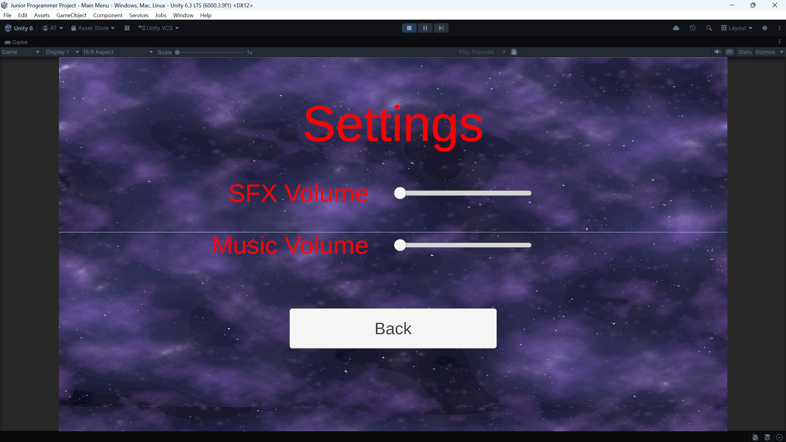
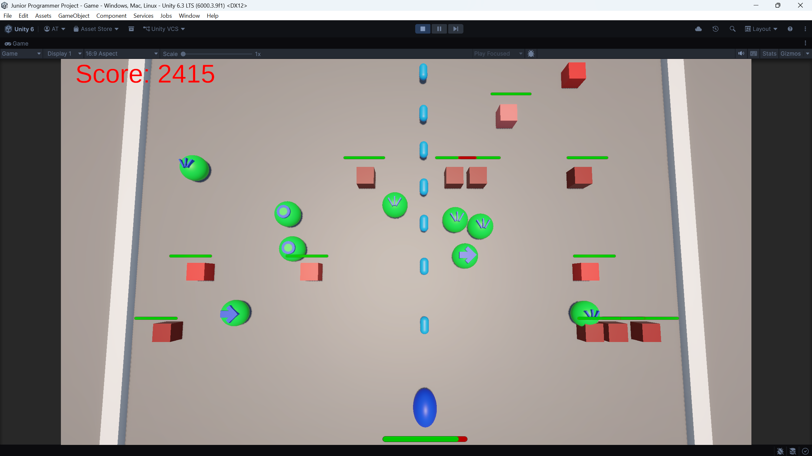
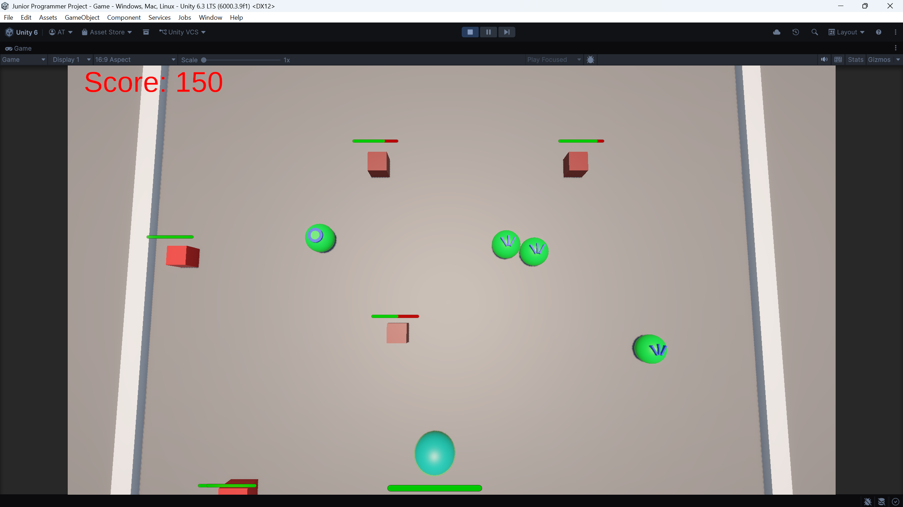
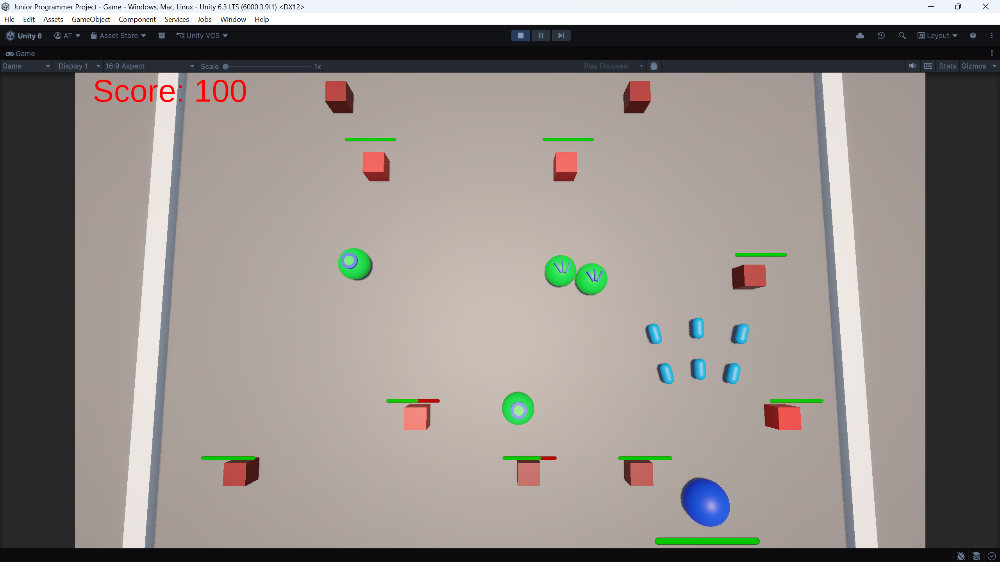
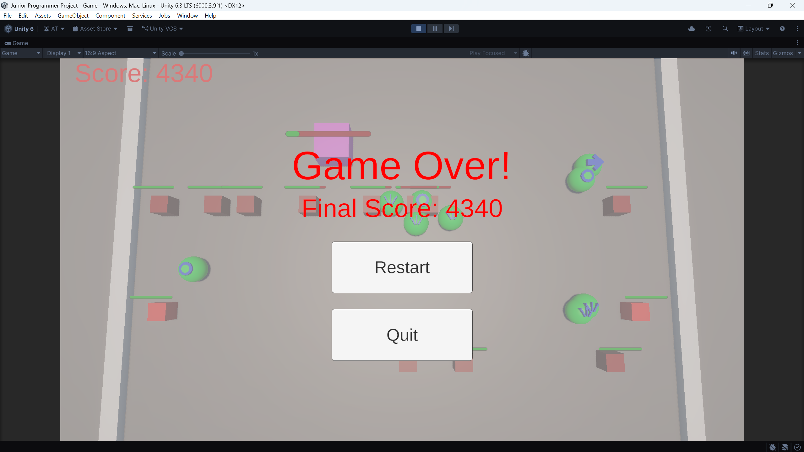

# Junior Programmer Project

A 3D space shooter built in Unity. The project has a main menu, a playable game scene, enemy waves with difficulty scaling, multiple enemy tiers, a boss encounter, powerups, player health, score tracking, pause/game-over/win UI, and animated menu/game UI states.

## Screenshots

### Main Menu

The main menu with layered parallax starfield background, title, play button, settings button, and quit button.

### Settings Menu

The settings overlay with music and SFX slider controls.

### Gameplay Start

The opening gameplay state with the player ship, score UI, and first enemy wave.

### Powerups

Collectible powerups spawning during gameplay.

### Shield Powerup

The player with the shield powerup active.

### Multifire Powerup

The player firing multiple projectiles after collecting the multifire powerup.

### Boss Fight

The boss encounter with the boss health bar and projectile spread attack.

### Paused

The pause overlay shown during gameplay.

### Game Over

The game-over screen with final score display.

### Win Screen

The win screen shown after defeating the boss.

## Project Overview

This project is structured as a small arcade-style survival shooter. The player controls a ship on a bounded playfield, moves left/right and forward/back, fires projectiles, collects powerups, destroys enemies for score, and eventually fights a boss. The game ends either when the player loses all health or when the boss is defeated.

The project contains two enabled build scenes:

- `Assets/Scenes/Main Menu.unity`
- `Assets/Scenes/Game.unity`

The Unity editor version recorded in the project is:

- Unity `6000.3.9f1`

Major Unity packages used:

- Universal Render Pipeline `17.3.0`
- Input System `1.18.0`
- TextMesh Pro
- Unity UI / uGUI
- Unity Test Framework

## Controls

The project uses Unity's new Input System through `InputSystem_Actions`.

Gameplay controls currently used by the scripts:

| Action | Keyboard / Mouse | Gamepad |
| --- | --- | --- |
| Move | WASD or arrow keys | Left stick |
| Fire | Left mouse button or Enter | West face button |
| Pause | Escape | UI cancel bindings |

The input asset also contains bindings for look, interact, crouch, jump, previous, next, sprint, UI navigation, submit, cancel, pointer, click, scroll, and tracked device input. Not all of those actions are currently used by the gameplay scripts.

## Main Menu

The main menu scene includes:

- A title screen with a menu overlay.
- Play, settings, and quit buttons.
- A settings overlay with Music and SFX sliders.
- A layered parallax starfield background.
- Animated transitions between the menu panel and settings panel.

Implemented menu behavior:

- `StartGame()` loads the game scene by build index.
- `QuitGame()` exits Play Mode inside the Unity editor or quits the application in a build.
- `OpenSettings()` and `CloseSettings()` toggle the settings animation state.
- `ParallaxBackground` duplicates a UI image and scrolls it in a loop to create continuous movement.

Current menu limitation:

- The Music and SFX sliders exist in the UI, but they are not wired to actual audio volume controls yet.

## Gameplay Scene

The game scene contains:

- A bounded 3D playfield.
- A player prefab.
- Spawn manager.
- Game manager.
- Score keeper.
- Main camera and lighting.
- Walls at the sides of the play area.
- UI canvas with score, pause overlay, game-over overlay, and win overlay.

The player is constrained to a fixed movement area:

- X range: `-15` to `15`
- Z range: `0` to `15`

Enemies spawn ahead of the player and move backward through the playfield. Projectiles and enemies destroy themselves when they go outside the configured Z range.

## Player

The player ship is implemented by `PlayerController`.

Player features:

- Reads movement, firing, and pause input from the Input System.
- Moves using transform translation.
- Has health and a world-space health bar.
- Fires projectiles with a cooldown.
- Plays firing animation triggers.
- Can be shielded.
- Can receive speed and multifire powerups.
- Stops physics drift after collisions so collisions do not push the ship around.
- Triggers game over when health reaches zero.

Current player prefab tuning:

| Setting | Value |
| --- | --- |
| Max health | `10` |
| Move speed | `15` |
| Projectile damage | `1` |
| Fire cooldown | `0.1` seconds |
| Multifire bullet count | `3` |
| Multifire spread angle | `15` degrees |

Collision behavior:

- Colliding with a normal enemy damages the player and destroys the enemy.
- Colliding with the boss damages both the boss and the player.
- Shield blocks one damage event and then turns off.

## Projectiles

Projectiles are handled by `ProjectileController`.

Projectile behavior:

- Move forward along their local `Vector3.up`.
- Destroy themselves when outside the Z range.
- Store an owner so player projectiles and boss projectiles damage different targets.
- Player-owned projectiles damage enemies and bosses.
- Boss-owned projectiles damage the player.

Current projectile prefab tuning:

| Setting | Value |
| --- | --- |
| Speed | `15` |
| Z range | `30` |
| Base damage | `1` |

## Enemy Waves

Enemy spawning is handled by `SpawnManager`.

The spawn manager starts three repeating systems:

- Enemy waves after `3` seconds, repeating every `3` seconds.
- Powerups after `5` seconds, repeating every `10` seconds.
- Boss spawn after the difficulty ramp duration.

Wave difficulty scaling:

| Setting | Value |
| --- | --- |
| Starting enemies per wave | `1` |
| Max enemies per wave | `10` |
| Time to max enemies | `180` seconds |
| Enemy weight stage duration | `15` seconds |

Enemy mix changes over time using weighted stages:

| Stage | Enemy 1 | Enemy 2 | Enemy 3 |
| --- | ---: | ---: | ---: |
| 1 | 100% | 0% | 0% |
| 2 | 75% | 25% | 0% |
| 3 | 25% | 50% | 25% |
| 4 | 10% | 40% | 50% |
| 5 | 10% | 30% | 60% |

Enemy prefabs:

| Enemy | Speed | Health | Score |
| --- | ---: | ---: | ---: |
| `Enemy_1` | `5` | `3` | `10` |
| `Enemy_2` | `4` | `5` | `25` |
| `Enemy_3` | `3` | `7` | `50` |

Each enemy has:

- A health value.
- A health bar.
- A score value.
- Forward movement toward the player.
- Out-of-bounds cleanup.

## Boss Encounter

The boss is implemented by `BossController`.

Boss behavior:

- Spawns at the enemy spawn area.
- Moves to a battle position at Z `15`.
- Moves side to side after reaching its battle position.
- Stops to fire volleys.
- Uses spread shots through a turret transform.
- Awards a large score bonus when defeated.
- Triggers the win screen when its health reaches zero.

Current boss prefab tuning:

| Setting | Value |
| --- | --- |
| Health | `100` |
| Speed | `15` |
| Battle Z position | `15` |
| Horizontal range | `15` |
| Delay between movement targets | `3` seconds |
| Bullets per volley | `3` |
| Volleys per firing sequence | `5` |
| Spread angle | `15` degrees |
| Fire cooldown | `0.1` seconds |
| Projectile damage | `1` |
| Score value | `500` |

Current boss limitation:

- The planned red-zone attack is not implemented yet.

## Powerups

Powerups are built with a ScriptableObject-based system.

Core files:

- `PowerupEffect` defines the common powerup data and apply/remove contract.
- `PowerupItem` handles trigger pickup and passes the effect to the player.
- `PlayerPowerUpManager` applies effects, tracks active powerups, and refreshes duration if the same powerup is collected again.

Implemented powerups:

| Powerup | Duration | Effect |
| --- | ---: | --- |
| Speed Boost | `10` seconds | Sets the player speed multiplier to `2` |
| Shield | `5` seconds | Enables a shield that blocks one hit |
| Multifire | `10` seconds | Enables three-shot spread firing |

Powerup spawning:

- Random powerup effect selected from the configured list.
- Spawned between Z `2` and Z `14`.
- Spawned every `10` seconds after an initial `5` second delay.

## UI and Game State

The game has several UI states:

- Normal playing state.
- Pause overlay.
- Game-over overlay.
- Win overlay.

`GameManager` is responsible for:

- Tracking whether the game is active.
- Toggling pause through `Time.timeScale`.
- Playing pause/resume UI animation states.
- Stopping spawns on game over or win.
- Displaying final score text.
- Restarting the current scene.
- Returning to the main menu scene.

UI helper scripts:

- `ScoreKeeper` tracks score and updates TextMesh Pro score text.
- `HealthBar` wraps a Unity UI Slider for player, enemy, and boss health.
- `FaceCamera` keeps world-space health bars facing the main camera.

## Art, Audio, and Presentation

The project includes several imported asset groups:

- Starfield background assets.
- Layered starfield background assets for the menu.
- Background music tracks.
- Sci-fi sound effect files.
- TextMesh Pro fonts, shaders, and settings.

There are also custom materials for gameplay objects:

- Boss material.
- Wall material.
- Shield material.
- Red, red dark, and red light materials.
- Blue and blue light materials.
- Green material.

Animation assets are organized into:

- `Animations/Player` for idle and firing states.
- `Animations/GameUI` for playing and paused UI states.
- `Animations/MenuUI` for menu and settings panel transitions.

## Code Structure

Main gameplay scripts:

| Script | Purpose |
| --- | --- |
| `GameManager` | Overall game state, pause, restart, quit, win, game over |
| `PlayerController` | Player movement, firing, health, collisions, powerup state |
| `SpawnManager` | Enemy waves, boss spawning, powerup spawning, difficulty ramp |
| `EnemyController` | Enemy movement, health, scoring, cleanup |
| `BossController` | Boss movement, shooting, health, scoring, win condition |
| `ProjectileController` | Projectile movement and damage routing |
| `PlayerPowerUpManager` | Active powerup duration tracking |
| `PowerupEffect` | Base ScriptableObject type for powerups |
| `PowerupItem` | Pickup trigger behavior |
| `SpeedBoost` | Speed boost implementation |
| `Shield` | Shield implementation |
| `Multifire` | Multifire implementation |
| `ScoreKeeper` | Score state and score text updates |
| `HealthBar` | Slider-based health display |
| `FaceCamera` | Camera-facing world-space UI |
| `MenuController` | Main menu button behavior |
| `ParallaxBackground` | Infinite scrolling UI background |

Generated or placeholder script:

- `InputSystem_Actions` is generated by Unity's Input System.
- `ObjectPool` currently exists as a placeholder and does not implement pooling yet.

## Current Project Status

Completed or mostly complete:

- Player movement and shooting.
- Player, enemy, and boss health.
- Health bar UI.
- Score tracking.
- Main menu UI.
- Pause UI.
- Game-over UI.
- Win UI.
- Enemy wave spawning.
- Difficulty scaling by wave size and enemy weights.
- Three enemy tiers.
- Boss encounter.
- ScriptableObject powerup system.
- Speed, shield, and multifire powerups.
- Menu and player/game UI animations.

In progress or unfinished:

- Object pooling is planned but not implemented.
- Settings sliders are present but are not wired to music/SFX volume.
- Boss red-zone attack is planned but not implemented.
- Audio assets are present, but gameplay/audio management is not fully represented in the current scripts.

## How to Run

1. Open the project in Unity `6000.3.9f1` or a compatible Unity 6 editor.
2. Open `Assets/Scenes/Main Menu.unity`.
3. Press Play.
4. Use Play on the main menu to load the gameplay scene.

The build settings already include:

1. `Main Menu`
2. `Game`
