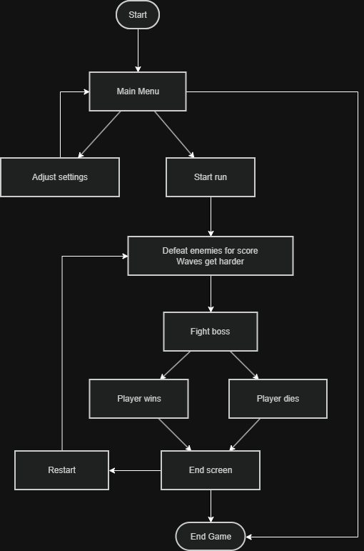
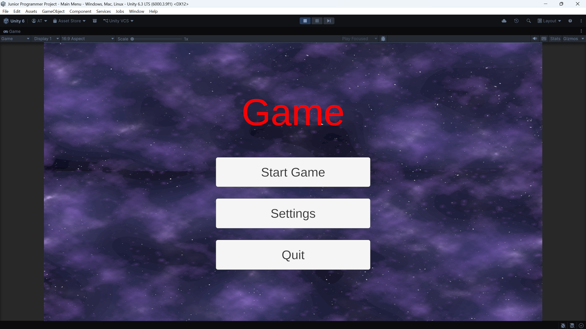
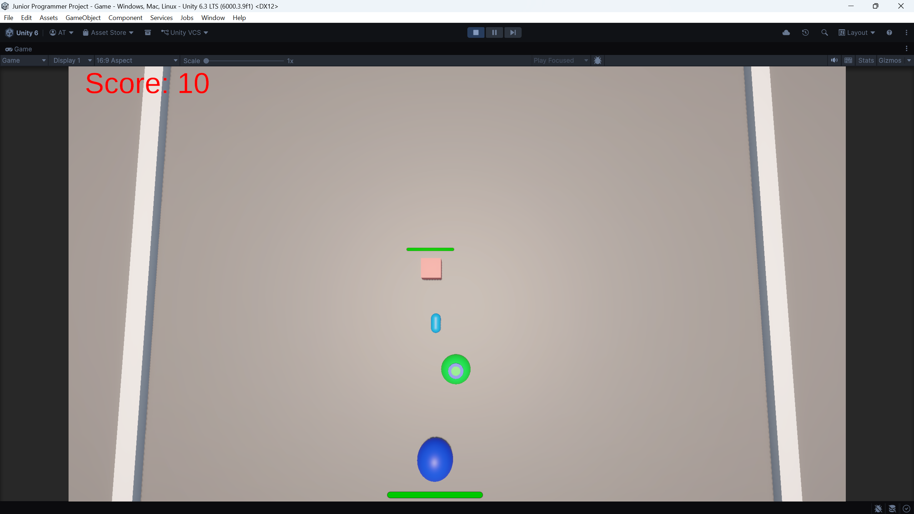
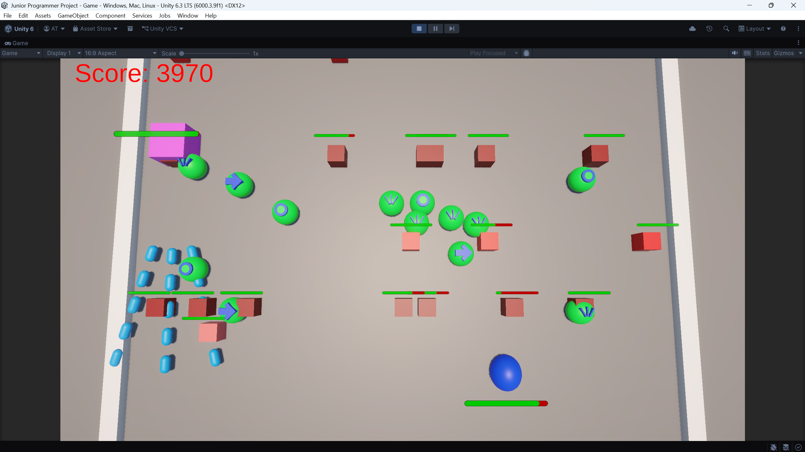
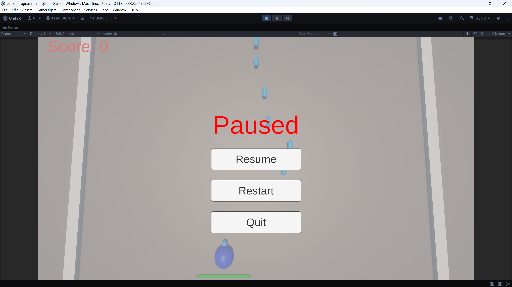
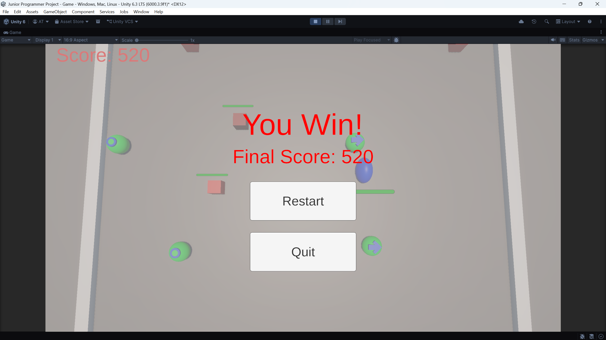

# Junior Programmer Project

A 3D space shooter built in Unity. The player survives enemy waves, collects powerups, builds score, and defeats a boss to win.

## Summary

- Built a complete arcade game loop with a main menu, gameplay scene, pause state, game-over state, and win state.
- Implemented player movement, shooting, collision damage, health bars, and score tracking.
- Created enemy wave spawning with difficulty scaling and three enemy tiers.
- Added a boss encounter with movement, health, score reward, and projectile volleys, and periodic arena-wide warning-zone attacks.
- Built a ScriptableObject-based powerup system for speed boost, shield, and multifire.
- Added looping scene music, volume controls, shared button sounds, and event-driven gameplay SFX.
- Added projectile impact, player death, and boss death particle effects.
- Added a shared projectile object pool used by both the player and spawned boss, avoiding repeated projectile instantiation and destruction during gameplay.
- Added animated UI screens, parallax menu background, and fullscreen-aware UI scaling.
- Organized gameplay code into focused Unity components for player, enemies, boss, spawning, powerups, UI, and menu behavior.

For detailed tuning values and implementation notes, see [design.md](design.md).

## Project Structure

```text
Junior Programmer Project/
|-- Assets/
|   |-- Animations/
|   |   |-- GameUI/
|   |   |-- MenuUI/
|   |   `-- Player/
|   |-- Asset Packs/
|   |   |-- Background Music/
|   |   |-- Sci-fi Sounds/
|   |   |-- Starfield Background/
|   |   `-- Starfield Layered Background/
|   |-- Materials/
|   |-- Particles/
|   |-- Powerups/
|   |-- Prefabs/
|   |-- Scenes/
|   |   |-- Main Menu.unity
|   |   `-- Game.unity
|   `-- Scripts/
|       |-- GameScene/
|       |   |-- Combat/
|       |   |-- Core/
|       |   |-- Enemies/
|       |   |-- Infrastructure/
|       |   |-- Input/
|       |   |-- Player/
|       |   |-- Powerups/
|       |   `-- UI/
|       `-- MainMenuScene/
|-- Packages/
|-- ProjectSettings/
|-- Screenshots/
|-- design.md
`-- readme.md
```

## Gameplay Flow



Editable source: [Screenshots/Flowchart.drawio](Screenshots/Flowchart.drawio)

## Screenshots

### Main Menu



### Gameplay Start



### Boss Fight



### Paused



### Win Screen



## Gameplay Video

[Watch the gameplay demo](https://www.dropbox.com/scl/fi/h5avcqdjesgjzb75sj2hr/Demo_01.mp4?rlkey=1oj2cia6x0762l1zdopedepdi&st=m2rrcpx7&dl=0)

## Play Online

Unity Play link: To be added

## How to Run Locally

1. Open the project in Unity `6000.3.9f1` or a compatible Unity 6 editor.
2. Open `Assets/Scenes/Main Menu.unity`.
3. Press Play.
4. Use the main menu Play button to start the game.
